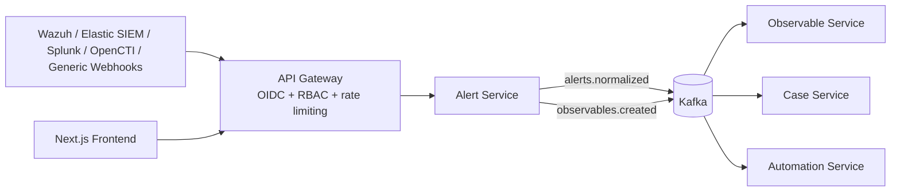

# SIRP - Security Incident Response Platform

Production-oriented, event-driven SOC platform inspired by TheHive with real SIEM connectors and OpenCTI for threat intelligence.

## 1) Architecture Diagram



## 2) Docker Setup

- `docker-compose.yml` - development stack
- `docker-compose.prod.yml` - production baseline
- Multi-stage Dockerfiles for all services

### Kubernetes

- **Supported**: all services are container images; inter-service URLs follow the same hostnames as Compose (e.g. `http://case-service:8001`) unless overridden by env.
- **In-repo**: `k8s/base.yaml` is a **minimal example** (alert-service only). Full infra (Postgres, Kafka, Redis, ES, Keycloak, …) is expected to come from **managed services** or **Helm charts** — see **[k8s/README.md](k8s/README.md)** for checklist, secrets, Ingress/WebSocket notes, and `API_GATEWAY_URL` for case-service.

Included runtime services:

- `api-gateway`
- `keycloak`
- `kafka`, `zookeeper`
- `postgres`
- `elasticsearch`
- `redis`
- `vault`
- `prometheus`, `grafana`, `jaeger`
- `alert-service`, `case-service`, `observable-service`, `automation-service`, `notification-service`, `secret-service`
- `frontend`

## 3) Core Services

- `api-gateway`: OIDC JWT validation, RBAC, routing
- `alert-service`: SIEM connectors, normalization, dedupe, Kafka publishing
- `case-service`: alert-to-case escalation, assignment/ownership
- `observable-service`: IOC dedupe/correlation from `observables.created`
- `automation-service`: SOAR-lite actions
- `frontend`: Next.js SOC dashboard

## Setup

1. Copy environment file:

```bash
cp .env.example .env
```

2. Fill API keys and SIEM credentials in `.env`.
3. Start stack:

```bash
docker compose up -d --build
```

4. Create Kafka topics:

```bash
bash infra/kafka/create-topics.sh
```

5. Open:
   - API Gateway: `http://localhost:8000`
   - Frontend: `http://localhost:3000`
   - Keycloak: `http://localhost:8080`
   - Grafana: `http://localhost:3001`
   - Jaeger: `http://localhost:16686`

6. Login to UI:
   - Open `http://localhost:3000/login`
   - Use credentials from `.env`:
     - `INITIAL_ADMIN_USERNAME`
     - `INITIAL_ADMIN_PASSWORD`
   - JWT is signed with `APP_AUTH_JWT_SECRET`
   - Admin features require `admin` role from this local auth token

## SIEM Integration

### Wazuh

- Pull ingestion endpoint: `POST /alerts/connectors/pull/wazuh`
- External ingest endpoint (recommended): `POST /ingest/wazuh`
- Internal webhook endpoint (service-level): `POST /alerts/alerts/webhook/wazuh`
- Required env: `WAZUH_URL`, `WAZUH_USER`, `WAZUH_PASSWORD`
- Optional ingress auth env: `INBOUND_WEBHOOK_TOKEN` (gateway validates `x-webhook-token` or bearer token)
- Behavior: Authenticates against Wazuh API, fetches events, normalizes, deduplicates, publishes to Kafka.
- Ready integration script: `integrations/wazuh/sirp_integration.py`

### Elastic SIEM

- Pull ingestion endpoint: `POST /alerts/connectors/pull/elastic`
- Required env: `ELASTIC_SIEM_URL`, `ELASTIC_SIEM_API_KEY`, `ELASTIC_SIEM_INDEX`
- Behavior: Queries SIEM index, maps ECS/kibana alert fields to internal schema.

### Splunk

- Pull ingestion endpoint: `POST /alerts/connectors/pull/splunk`
- Webhook ingestion endpoint: `POST /alerts/alerts/webhook/splunk`
- Required env: `SPLUNK_URL`, `SPLUNK_TOKEN`, `SPLUNK_SAVED_SEARCH`
- Behavior: Dispatches saved search job via Splunk REST API and ingests results.

### Microsoft Sentinel

- Pull ingestion endpoint: `POST /alerts/connectors/pull/sentinel`
- Required env:
  - `SENTINEL_TENANT_ID`
  - `SENTINEL_CLIENT_ID`
  - `SENTINEL_CLIENT_SECRET`
  - `SENTINEL_SUBSCRIPTION_ID`
  - `SENTINEL_RESOURCE_GROUP`
  - `SENTINEL_WORKSPACE`
- Behavior: Uses Azure AD client credentials and calls SecurityInsights incidents API on Azure Management endpoint.

### OpenCTI (Threat Intelligence Platform)

- Pull ingestion endpoint: `POST /alerts/connectors/pull/opencti`
- Required env:
  - `OPENCTI_URL`
  - `OPENCTI_TOKEN` (Personal Access Token from OpenCTI user profile — not a connector ID; do not prefix with `Bearer `), or `OPENCTI_API_KEY` as alias, or `OPENCTI_USER` + `OPENCTI_PASSWORD` for GraphQL `token` login
- Optional env:
  - `OPENCTI_QUERY_LIMIT`
  - `OPENCTI_AUTO_SYNC_ENABLED` (`true|false`)
  - `OPENCTI_AUTO_SYNC_INTERVAL_SECONDS`
- Behavior:
  - Pulls real observables from OpenCTI GraphQL API (`stixCyberObservables`)
  - Normalizes to internal alert schema
  - Publishes to Kafka (`alerts.*`, `observables.created`) like other sources
  - Can run periodic auto-sync loop when enabled
- Per-IOC lookup (UI + API): `POST /alerts/opencti/lookup` with JSON `{"value": "<ioc>", "first": 20}` — server calls `{OPENCTI_URL}/graphql` with `stixCyberObservables(search: …)` (same token as pull).
- When `OPENCTI_AUTO_SYNC_ENABLED=true`, set `THREAT_INTEL_PULL_SOURCE` to `opencti` (default), `abuseipdb`, or `both` to choose scheduled pull behavior.

### AbuseIPDB (IP reputation)

- Pull ingestion endpoint: `POST /alerts/connectors/pull/abuseipdb` (query params: `limit`, `confidence_minimum`) — fetches the AbuseIPDB blacklist and ingests each IP as an alert. Availability depends on your AbuseIPDB plan.
- Required env: `ABUSEIPDB_API_KEY` (from [AbuseIPDB API](https://www.abuseipdb.com/api)) — same env-or-secret-service pattern as other keys.
- Optional env: `ABUSEIPDB_API_BASE`, `ABUSEIPDB_BLACKLIST_LIMIT`, `ABUSEIPDB_CONFIDENCE_MINIMUM`.
- Per-IP lookup (UI + API): `POST /alerts/abuseipdb/lookup` with JSON `{"value": "<ipv4-or-ipv6>", "maxAgeInDays": 90}` — server calls AbuseIPDB `GET /check`.
- Case **Observables** tab includes a **Threat intel source** dropdown (OpenCTI vs AbuseIPDB) for the **Lookup** action; AbuseIPDB applies only to IP observables.

### Generic SIEM

- Webhook endpoint: `POST /alerts/alerts/webhook/generic`
- Behavior: Accepts JSON payload, normalizes with source/severity/title/description mapping.

## Alert -> Case Workflow

- Alert actions:
  - Assign: `POST /alerts/alerts/{alert_id}/assign`
  - Add tags: `POST /alerts/alerts/{alert_id}/tags`
  - Status lifecycle: `POST /alerts/alerts/{alert_id}/status` (`new|triaged|escalated|closed`)
  - Escalate: `POST /alerts/alerts/{alert_id}/escalate`
  - Delete one: `DELETE /alerts/alerts/{alert_id}`
  - **Purge all**: `DELETE /alerts/alerts` (see [Alert service bulk delete](#alert-service-bulk-delete))
  - **Risk score**: computed on alert read and exposed in UI/API for queue prioritization
- Case actions:
  - Create manually (no alert): `POST /cases/cases` with JSON `title`, optional `description`, `severity`, `owner`, `tags`
  - Create from alert: `POST /cases/cases/from-alert`
  - Assignment tracking (`assigned_by`, `assigned_to`, `assigned_at`)
  - Ownership enforcement (owner/admin for status updates)
  - Case lifecycle (`open|in-progress|resolved|closed`)
  - Timeline, comments, tasks
  - Evidence files: `POST /cases/cases/{id}/evidence` (multipart `file` + optional `uploaded_by`), download `GET …/evidence/{evidence_id}/file`, delete `DELETE …/evidence/{evidence_id}` — files on disk (`CASE_EVIDENCE_DIR`), metadata on case JSON; UI tab **Evidence** on case detail.
  - **Case correlation & linking**: `GET /cases/cases/{id}/related` suggests other cases (IOC overlap + shared tags within a time window); `POST /cases/cases/{id}/link` links two cases bidirectionally (`linked_case_ids`). UI: case tab **Investigation** (related cases, optional related alerts when the case has `alert_id`, merged **investigation timeline**).
  - **Merged investigation timeline**: `GET /cases/cases/{id}/investigation-timeline` combines case timeline, comments, tasks, evidence, and source alert (requires `ALERT_SERVICE_URL` on case-service).
  - **SOC metadata** (gateway-proxied case routes): `incident_category`, `legal_hold`, `shift_handover_notes`, `audit_events` on the case payload; UI **SOC** tab.
  - **Export**: `GET /cases/cases/{id}/export` — full case JSON for audit/handover; UI downloads via gateway; optional **custody** log entry from UI.

### Global search & audit (gateway)

- **Search** (UI `/search`, API `GET /search?q=…`): one query across cases (title, description, tags, comments, evidence filenames), alerts, and observables; requires analyst/responder/admin/readonly JWT.
- **Audit log** (UI `/audit`, API `GET /audit/events`): append-only table `sirp_audit_log` in gateway Postgres; records successful mutating proxy calls (method/path/status) and explicit admin user mutations. Query params: `limit`, `offset`, `actor`, `resource_type`. Rows are not updatable via the API.

## Security Controls

- OIDC/JWT validation via Keycloak in `api-gateway`
- RBAC checks for case/automation routes
- Zero-trust internal auth using `x-internal-token` (`INTERNAL_SERVICE_TOKEN`)
- SIEM ingress IP allowlist (`INGEST_ALLOWLIST`)
- Vault-ready deployment (`vault` service)
- Centralized encrypted secret storage (`secret-service`) for runtime API keys
- Field encryption at rest for sensitive case fields (`DATA_ENCRYPTION_KEY` / Fernet)
- Audit trail: Kafka event history (`alerts.*`, `cases.updated`) plus **immutable gateway audit log** (`sirp_audit_log`, `GET /audit/events`)

## Admin Panel - API Keys

- Admin UI page: `/admin`
- Requirement: Keycloak **admin** bearer token
- Panel can set/update API keys and integration secrets at runtime (stored encrypted in PostgreSQL via `secret-service`)
- Gateway admin endpoints:
  - List: `GET /secrets/secrets`
  - Upsert: `PUT /secrets/secrets/{key}`
  - Delete: `DELETE /secrets/secrets/{key}`

Supported runtime keys include SIEM, OpenCTI, SMTP, and webhook credentials (e.g. `OPENCTI_TOKEN`, `SPLUNK_TOKEN`, `SENTINEL_CLIENT_SECRET`, `SLACK_WEBHOOK_URL`).

## Real-Time Operations (Phase 2)

- WebSocket event stream endpoint: `ws://<gateway>/stream/events` (JWT as query `token` or `Authorization` header)
- Frontend **Live feed** widget on Alerts and Cases pages
- Observable worker consumes `observables.created` and stores IOCs (dedupe + Elasticsearch index)

## Phase 3 — Notifications

- **notification-service**: Kafka consumer on `cases.updated`; dispatches **SMTP**, **Slack**, **Discord** when secrets are set
- **Test ping** (analyst+): `POST /notifications/notifications/test` via gateway (`/notifications/notifications/test` from browser with Bearer JWT)
- **@mention ping** (internal): `POST /notifications/mentions` — used by the gateway when case comments contain `@username`
- Gateway routes the `notifications` service (always forwards `x-internal-token` when configured)

## SOC — Gateway APIs & Postgres (`/soc/*`)

All routes below are on the **API gateway** (prefix as proxied from UI: `/sirp-api/...`). They require a Bearer JWT unless noted.

| Area | Method | Path | Notes |
|------|--------|------|--------|
| Summary | GET | `/soc/summary` | Aggregated alert/case metrics for dashboards |
| Hunting (saved) | GET/POST/DELETE | `/soc/hunting/queries`, `/soc/hunting/queries/{id}` | Per-user saved queries in `sirp_saved_hunts` |
| Ops health | GET | `/soc/ops-status` | Health of each `SERVICE_MAP` service + gateway DB |
| Ops history | GET | `/soc/ops-history` | Throttled snapshots in `sirp_ops_snapshots` (~1 row / 3 min when polled) |
| Notification config | GET | `/soc/notification-delivery-status` | Which channel **keys** exist in secret-service (no values) |
| Chain of custody | POST/GET | `/soc/custody-log` | Append-only `sirp_chain_of_custody` |
| Shift handover | POST/GET | `/soc/shift-report`, `/soc/shift-reports` | Structured reports in `sirp_shift_reports` |
| Case watchlist | POST/DELETE/GET | `/soc/watchlist`, `/soc/watchlist/{case_id}` | `sirp_case_watchers` |
| Mentions (UI) | GET | `/soc/mentions/for-me` | Rows for the logged-in username |
| Mentions (internal) | POST | `/soc/internal/mentions/ingest` | **`x-internal-token` only** — called by case-service |
| Watcher ping (internal) | POST | `/soc/internal/watchers/notify` | **`x-internal-token` only** — case updates → watchers |
| Playbook approval | POST/GET | `/soc/playbook-run-requests` | Optional multi-step `approval_chain` JSON |
| Approve / reject | POST | `/soc/playbook-run-requests/{id}/approve`, `.../reject` | Responder/admin; multi-step advances until automation runs |
| Live investigation graph | GET | `/soc/investigation-graph` | `case_id` and/or `alert_id` — live upstream fetch |
| IR bundle | GET | `/soc/investigation-bundle?case_id=` | Export + graph + custody tail; logs custody server-side |
| Analytics+ | GET | `/soc/analytics-advanced` | Status distributions, unassigned counts, closure ratio |
| Retro IOC | GET | `/soc/retro-hunt?q=` | Substring match over observable-service list (~1000 rows) |
| Retro SIEM | GET | `/soc/retro-hunt/siem?q=` | Proxies to alert-service **Elasticsearch** search |
| Intel hints | GET | `/soc/enrichment-hints?alert_id=` | Pivot hints (OpenCTI / AbuseIPDB) per alert IOCs |
| Graph index | POST | `/soc/graph/reindex` | Admin JWT or internal token — fills `sirp_entity_edges` |
| Graph query | GET | `/soc/graph/neighbors` | `focus_kind` + `focus_id` — read materialized edges |

**case-service** calls the gateway when **`API_GATEWAY_URL`** and **`INTERNAL_SERVICE_TOKEN`** are set (e.g. `API_GATEWAY_URL=http://api-gateway:8000` in Docker Compose): **@mentions** ingest, **watcher** notifications on case events (`comment_added`, `status_updated`, `task_added`, etc.).

## Alert service bulk delete

- **`DELETE /alerts`** (via gateway: **`DELETE /alerts/alerts`**) — removes **all** alerts from Postgres, clears in-memory cache, and deletes Redis keys `alert:dedupe:*`. **Analyst+** only (same as other alert mutations). UI: Alerts page **Clear all alerts** (double confirm).

## SIEM retro-search (Elasticsearch)

- **alert-service**: **`GET /alerts/siem-retro-search`** (must be registered **before** `/alerts/{alert_id}`). Query params: `q`, `size`, optional `index`.
- Default index env: **`ELASTIC_SIEM_INDEX`** (e.g. `wazuh-alerts-*`). Gateway exposes **`GET /soc/retro-hunt/siem`** for authenticated SOC users.

## Frontend — routes & features

| Path | Purpose |
|------|---------|
| `/` | Dashboard: KPIs, SOC summary, **platform health** (`/soc/ops-status`), recent alerts/cases |
| `/search` | Global search |
| `/hunting` | Saved queries: **browser** (localStorage) + **server** (`/soc/hunting/queries`) |
| `/alerts` | List with filters, presets, **bulk** assign/tags/status/escalate, **Clear all alerts**, live feed |
| `/alerts/[id]` | Alert detail, risk score, intel hooks |
| `/cases` | Case list |
| `/cases/[id]` | Tabs: overview, investigation, **SOC** (taxonomy, legal hold, handover), evidence, tasks, comments (**@mention**), timeline, observables; **Export JSON**, **Watch case**, link to IR center |
| `/observables` | IOC list |
| `/playbooks` | Automation playbooks & run history |
| `/statistics` | Charts + MITRE-style heuristics from tags/titles |
| `/operations` | Service health, auto-refresh, optional desktop notifications, ops snapshot history |
| `/notifications` | Channel key status + **send test** (analyst+) |
| `/ir-center` | **IR command center**: live/indexed graph, IR bundle download, shift reports, custody log, playbook approvals, @mentions inbox, analytics+, dual retro-hunt, watchlist, enrichment hints |
| `/audit` | Gateway audit log |
| `/admin` | Secrets / admin (admin role) |
| `/login` | Local JWT login (`INITIAL_ADMIN_*`, `APP_AUTH_JWT_SECRET`) |

Nav also includes **OpenCTI** when `NEXT_PUBLIC_OPENCTI_URL` is set. **Analyzers** route redirects to OpenCTI or `/`.

## FE/BE integration checklist

- **RBAC**: `readonly` can read most SOC data; **analyst/responder/admin** can mutate alerts, cases, hunting saves, custody logs, shift reports, watchlist, playbook requests, and **Clear all alerts**. **Responder/admin** approve playbook runs (per-step if `approval_chain` is set). **Admin** (or internal token) can **graph reindex**.
- **Keycloak**: When using realm JWTs, align usernames with **`@mentions`** (`preferred_username`).
- **Secrets** for notifications: `SMTP_*`, `NOTIFY_EMAIL_TO`, `SLACK_WEBHOOK_URL`, `DISCORD_WEBHOOK_URL` (via `/admin` → secret-service).

## Tests

- `tests/test_case_encryption.py` validates encryption/decryption of sensitive payload fields
- Run tests:

```bash
pytest -q tests
```

## ❤️ Support This Project
If you find this useful, consider sponsoring me on GitHub!

👉 https://github.com/sponsors/adriyansyah-mf