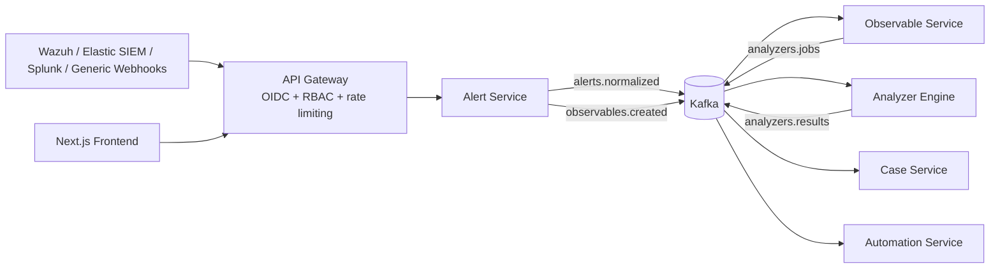

# SIRP - Security Incident Response Platform

Production-oriented, event-driven SOC platform inspired by TheHive with real SIEM connectors and analyzer integrations.

## 1) Architecture Diagram



## 2) Docker Setup

- `docker-compose.yml` - development stack
- `docker-compose.prod.yml` - production baseline
- Multi-stage Dockerfiles for all services

Included runtime services:

- `api-gateway`
- `keycloak`
- `kafka`, `zookeeper`
- `postgres`
- `elasticsearch`
- `redis`
- `vault`
- `prometheus`, `grafana`, `jaeger`
- `alert-service`, `case-service`, `observable-service`, `analyzer-service`, `automation-service`, `notification-service`, `secret-service`
- `frontend`

## 3) Core Services

- `api-gateway`: OIDC JWT validation, RBAC, routing
- `alert-service`: SIEM connectors, normalization, dedupe, Kafka publishing
- `case-service`: alert-to-case escalation, assignment/ownership
- `observable-service`: IOC dedupe/correlation, analyzer trigger
- `analyzer-service`: real external API analyzers
- `automation-service`: SOAR-lite actions
- `frontend`: Next.js SOC dashboard

## Setup

1. Copy environment file:

```bash
cp .env.example .env
```

2. Fill API keys and SIEM credentials in `.env`.
3. Start stack:

```bash
docker compose up -d --build
```

4. Create Kafka topics:

```bash
bash infra/kafka/create-topics.sh
```

5. Open:
   - API Gateway: `http://localhost:8000`
   - Frontend: `http://localhost:3000`
   - Keycloak: `http://localhost:8080`
   - Grafana: `http://localhost:3001`
   - Jaeger: `http://localhost:16686`

6. Login to UI:
   - Open `http://localhost:3000/login`
   - Use credentials from `.env`:
     - `INITIAL_ADMIN_USERNAME`
     - `INITIAL_ADMIN_PASSWORD`
   - JWT is signed with `APP_AUTH_JWT_SECRET`
   - Admin features require `admin` role from this local auth token

## Required API Keys

- `ABUSEIPDB_API_KEY`
- `IPINFO_TOKEN`
- `VIRUSTOTAL_API_KEY`
- `URLSCAN_API_KEY`
- `GOOGLE_SAFE_BROWSING_API_KEY`
- `MALWAREBAZAAR_API_KEY` (optional for API-authenticated requests)

## SIEM Integration

### Wazuh

- Pull ingestion endpoint: `POST /alerts/connectors/pull/wazuh`
- External ingest endpoint (recommended): `POST /ingest/wazuh`
- Internal webhook endpoint (service-level): `POST /alerts/alerts/webhook/wazuh`
- Required env: `WAZUH_URL`, `WAZUH_USER`, `WAZUH_PASSWORD`
- Optional ingress auth env: `INBOUND_WEBHOOK_TOKEN` (gateway validates `x-webhook-token` or bearer token)
- Behavior: Authenticates against Wazuh API, fetches events, normalizes, deduplicates, publishes to Kafka.
- Ready integration script: `integrations/wazuh/sirp_integration.py`

### Elastic SIEM

- Pull ingestion endpoint: `POST /alerts/connectors/pull/elastic`
- Required env: `ELASTIC_SIEM_URL`, `ELASTIC_SIEM_API_KEY`, `ELASTIC_SIEM_INDEX`
- Behavior: Queries SIEM index, maps ECS/kibana alert fields to internal schema.

### Splunk

- Pull ingestion endpoint: `POST /alerts/connectors/pull/splunk`
- Webhook ingestion endpoint: `POST /alerts/alerts/webhook/splunk`
- Required env: `SPLUNK_URL`, `SPLUNK_TOKEN`, `SPLUNK_SAVED_SEARCH`
- Behavior: Dispatches saved search job via Splunk REST API and ingests results.

### Microsoft Sentinel

- Pull ingestion endpoint: `POST /alerts/connectors/pull/sentinel`
- Required env:
  - `SENTINEL_TENANT_ID`
  - `SENTINEL_CLIENT_ID`
  - `SENTINEL_CLIENT_SECRET`
  - `SENTINEL_SUBSCRIPTION_ID`
  - `SENTINEL_RESOURCE_GROUP`
  - `SENTINEL_WORKSPACE`
- Behavior: Uses Azure AD client credentials and calls SecurityInsights incidents API on Azure Management endpoint.

### OpenCTI (Threat Intelligence Platform)

- Pull ingestion endpoint: `POST /alerts/connectors/pull/opencti`
- Required env:
  - `OPENCTI_URL`
  - `OPENCTI_TOKEN`
- Optional env:
  - `OPENCTI_QUERY_LIMIT`
  - `OPENCTI_AUTO_SYNC_ENABLED` (`true|false`)
  - `OPENCTI_AUTO_SYNC_INTERVAL_SECONDS`
- Behavior:
  - Pulls real observables from OpenCTI GraphQL API (`stixCyberObservables`)
  - Normalizes to internal alert schema
  - Publishes to Kafka and continues auto-enrichment pipeline
  - Can run periodic auto-sync loop when enabled

### Generic SIEM

- Webhook endpoint: `POST /alerts/alerts/webhook/generic`
- Behavior: Accepts JSON payload, normalizes with source/severity/title/description mapping.

## Alert -> Case Workflow

- Alert actions:
  - Assign: `POST /alerts/alerts/{alert_id}/assign`
  - Add tags: `POST /alerts/alerts/{alert_id}/tags`
  - Status lifecycle: `POST /alerts/alerts/{alert_id}/status` (`new|triaged|escalated|closed`)
  - Run analyzers: `POST /alerts/alerts/{alert_id}/run-analyzers`
  - Escalate: `POST /alerts/alerts/{alert_id}/escalate`
- Case actions:
  - Create from alert: `POST /cases/cases/from-alert`
  - Assignment tracking (`assigned_by`, `assigned_to`, `assigned_at`)
  - Ownership enforcement (owner/admin for status updates)
  - Case lifecycle (`open|in-progress|resolved|closed`)
  - Timeline, comments, tasks

## Analyzer Integrations (Real APIs)

- IP: AbuseIPDB + IPinfo
- Domain: WHOIS + DNS (A/MX/TXT)
- URL: Google Safe Browsing + URLScan
- Hash: VirusTotal + MalwareBazaar
- Email: Header parsing + domain reputation

Resilience controls:

- Retry with exponential backoff (`tenacity`)
- Timeout per analyzer job (`asyncio.wait_for`)
- Circuit breaker state in Redis
- DLQ publishing to `analyzers.jobs.dlq`
- Idempotency via Redis dedupe keys

## Security Controls

- OIDC/JWT validation via Keycloak in `api-gateway`
- RBAC checks for case/analyzer/automation routes
- Zero-trust internal auth using `x-internal-token` (`INTERNAL_SERVICE_TOKEN`)
- SIEM ingress IP allowlist (`INGEST_ALLOWLIST`)
- Vault-ready deployment (`vault` service)
- Centralized encrypted secret storage (`secret-service`) for runtime API keys
- Field encryption at rest for sensitive case fields (`DATA_ENCRYPTION_KEY` / Fernet)
- Audit trail through Kafka event history (`alerts.*`, `cases.updated`, `analyzers.results`)

## Admin Panel - API Keys

- Admin UI page: `/admin`
- Requirement: Keycloak **admin** bearer token
- Panel can set/update API keys and integration secrets at runtime (stored encrypted in PostgreSQL via `secret-service`)
- Gateway admin endpoints:
  - List: `GET /secrets/secrets`
  - Upsert: `PUT /secrets/secrets/{key}`
  - Delete: `DELETE /secrets/secrets/{key}`

Supported runtime keys include analyzer, SIEM, OpenCTI, SMTP, and webhook credentials (e.g. `VIRUSTOTAL_API_KEY`, `OPENCTI_TOKEN`, `SPLUNK_TOKEN`, `SENTINEL_CLIENT_SECRET`, `SLACK_WEBHOOK_URL`).

## Real-Time Operations (Phase 2)

- WebSocket event stream endpoint: `GET ws://<gateway>/stream/events`
- Frontend live stream widget on Alerts and Cases pages
- Observable worker consumes `observables.created` and auto-triggers analyzer jobs
- Analyzer secret resolution supports Vault-first lookup with environment fallback
- Analyzer provider calls include rate-throttling and audit event output

## Phase 3 Additions

- Analyzer idempotency: `analyzed_jobs` PostgreSQL table prevents re-processing duplicate analyzer jobs.
- Notification microservice:
  - Kafka consumer on `cases.updated` and `analyzers.results`
  - SMTP, Slack webhook, and Discord webhook dispatch
  - Test endpoint: `POST /notifications/notifications/test` via gateway
- API Gateway routing now includes `notifications` service.

## FE/BE Integration Status

- Alerts page is now fully actionable from UI:
  - assign, tag, status update, run analyzers, escalate to case
- Observables page consumes live backend data from `GET /observables/observables`
- Analyzer Results page consumes backend data from `GET /analyzers/results`
- Case detail page now loads analyzer results tied to the case alert (`alert_id`)
- Analyzer service persists results in PostgreSQL (`analyzer_results`) for UI/API retrieval

## Tests

- `tests/test_risk_scoring.py` validates weighted risk scoring/verdicts
- `tests/test_case_encryption.py` validates encryption/decryption of sensitive payload fields
- Run tests:

```bash
pytest -q tests
```
